# NJU MOOC 1 EXAMS

## 1.1 Week 1 计算机系统概述

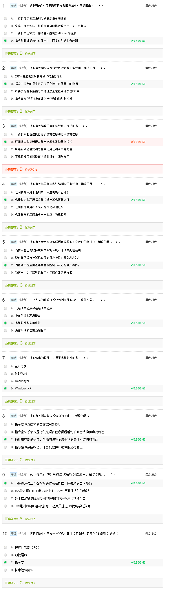

## 1.2 Week 2 数据的表示和存储

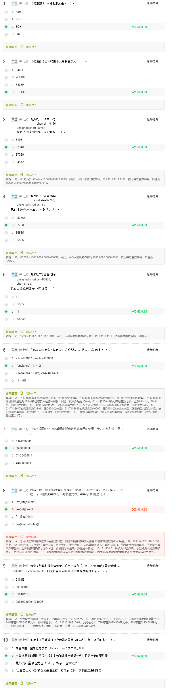

## 1.3 Week 3 运算电路基础

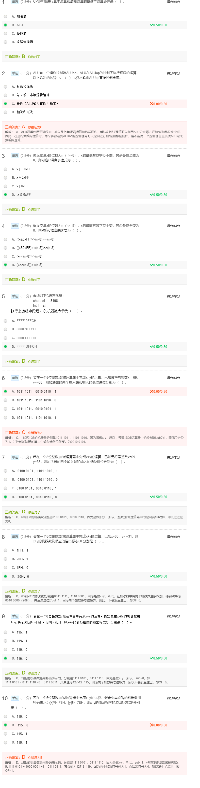

## 1.4 Week 4 乘除运算及浮点数运算

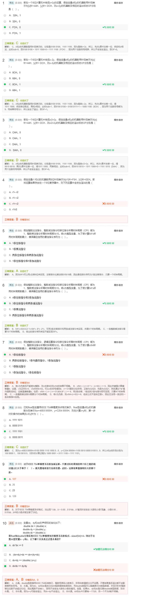

## 1.5 Week 5 IA-32指令系统概述

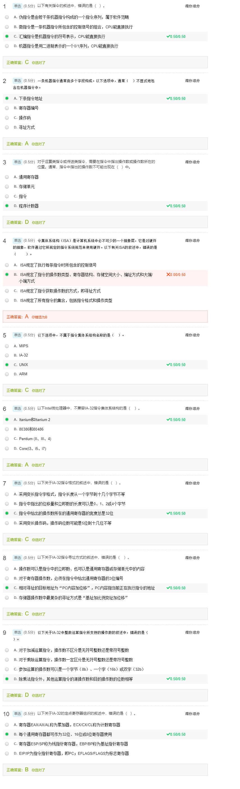

## 1.6 Week 6 IA-32指令类型

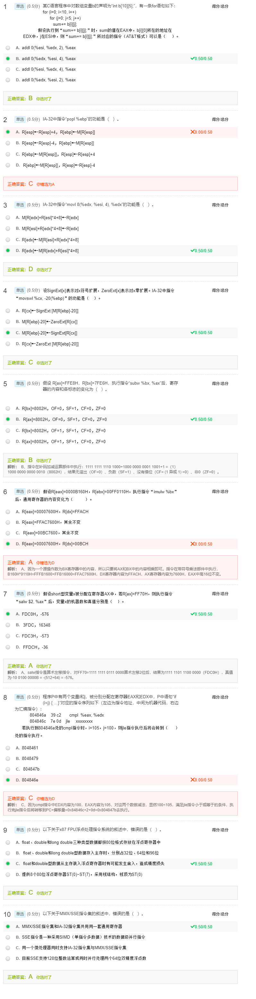

##1.7 Week 7 C语言语句的机器级表示

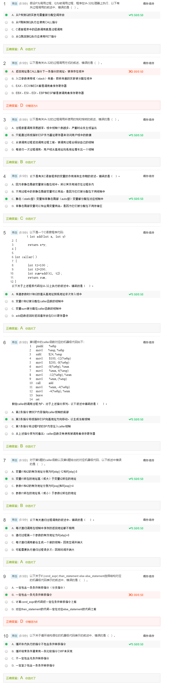

## 1.8 Week 8 复杂数据类型的机器级表示

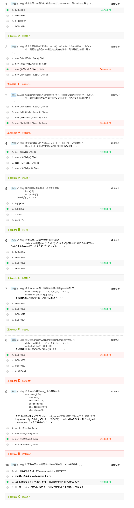

## 1.9 Week 9 x86-64指令系统

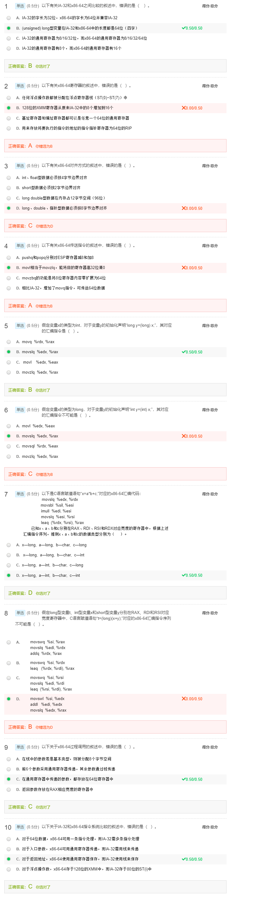

## 1.10 Week 10 链接概述和目标文件格式

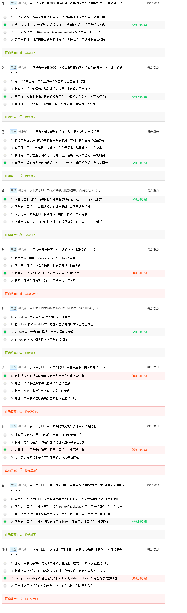

## 1.11 Week 11 符号及符号解析

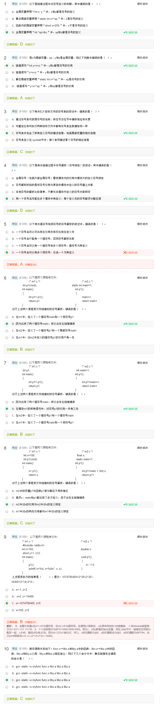

## 1.12 Week12 重定位及动态链接

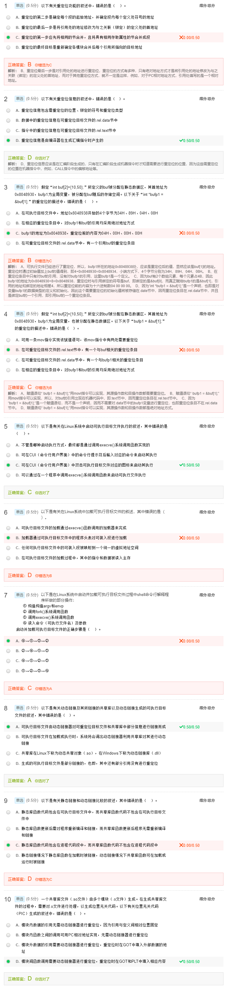